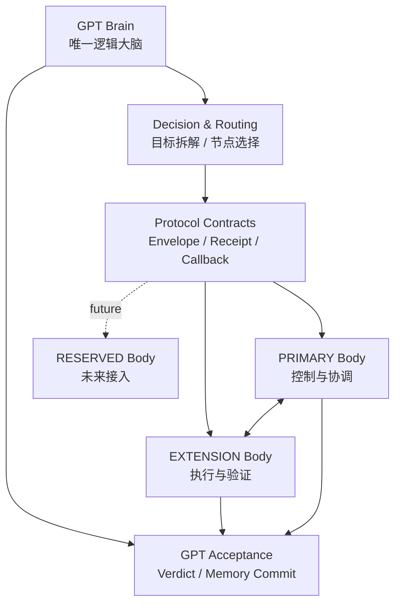
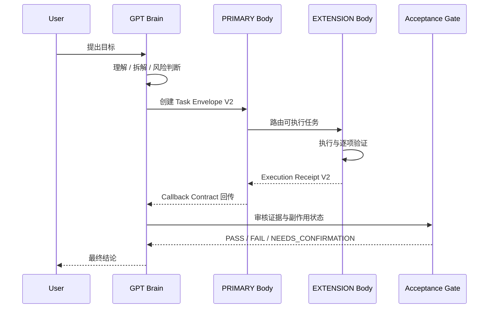
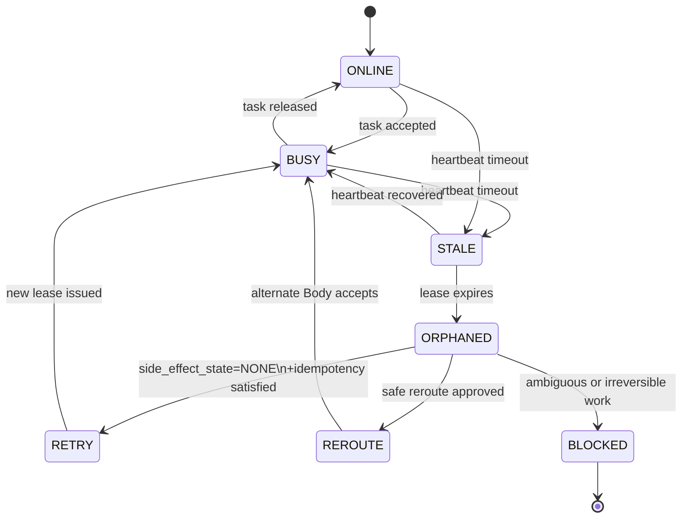

# GPT Multi-Body Protocol v1.0 架构说明

## 1. 架构定位

GPT Multi-Body Protocol 用于让一个 GPT Brain 统一协调多个运行在不同硬件上的 Codex Body。GPT 负责理解目标、拆解任务、选择执行节点、处理风险决策和最终验收；Body 负责在明确边界内执行、验证并回传事实。

协议 v1.0 是冻结的架构基线。后续生产守护进程、调度并发、故障转移和新硬件接入均通过 v1.x 或 v1.1 增量实现，保留兼容边界。

## 2. 总体分层



### 角色边界

| 角色 | 责任 | 权限边界 |
|---|---|---|
| GPT Brain | 目标理解、路由、决策、验收、记忆提交 | 唯一 GPT Acceptance authority |
| PRIMARY Body | 控制面、原任务上下文、路由协调、回执汇总 | 不能自行宣布 GPT_ACCEPTED 或 DONE |
| EXTENSION Body | 低风险执行、环境验证、执行回执 | 只能执行 Task Envelope 允许的范围 |
| RESERVED Body | 未来硬件模板与能力探针 | 未完成注册和验收前不得参与 routing |

## 3. 任务生命周期



关键规则：

1. `task_id` 标识任务，`event_id` 标识事件，`idempotency_key` 防止重复副作用。
2. Body `completed` 只表示执行层完成，GPT 仍需完成 Acceptance。
3. 任务继续执行时沿用原 task/thread 上下文，不能用新线程冒充原任务续作。
4. 涉及敏感信息、金额、合同、外部发送或不可逆动作时，Receipt 必须保留待决策项。

## 4. Heartbeat / Lease 与恢复



Heartbeat 证明 Body 仍可被观测，Lease 约束任务占用时间。两者都失效时，系统进入 `ORPHANED`，暂停自动推进。只有确认没有副作用且幂等条件满足，任务才能进入 `RETRY`；存在不确定副作用时进入 `BLOCKED` 或等待人工决策。

## 5. Bootstrap 与扩展方式

新 Body 的标准接入路径如下：

```text
Bootstrap → Register → Capability Probe → Health/Lease Check → Acceptance → ACTIVE
```

Bootstrap 负责建立协议目录和运行边界，注册表记录节点角色与能力，探针确认真实硬件和服务状态，GPT 完成最终接受。Mac Studio、Linux 节点或其他未来节点必须沿用同一套 schema 与验收门槛。

## 6. 冻结边界

当前冻结基线包含 Node/Client Registry、Node Interface、Task Envelope V2、Execution Receipt V2、GPT Verdict、Memory Proposal、Callback Contract、Continuous Context Inheritance、Heartbeat/Lease、Recovery/Retry、Bootstrap 和幂等保护。

生产化守护进程、Scheduler/Concurrency、Acting Primary/Failover 属于后续版本工作。它们不能直接改写 v1.0 核心字段或绕过 GPT Acceptance。
